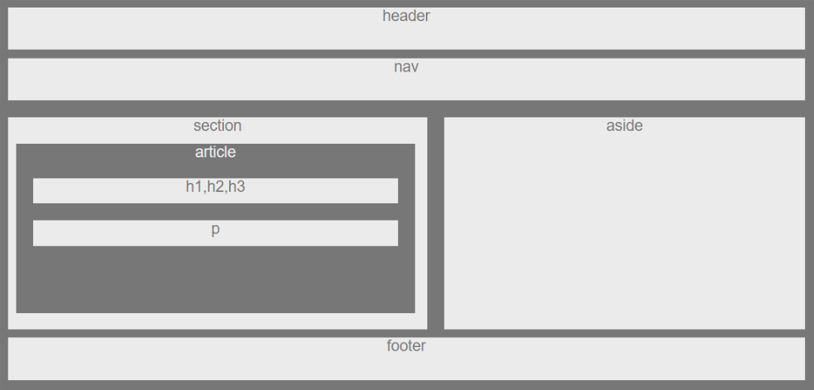

# HW-Wireframe

This is my first HTML and CSS project at Rutgers boot camp in NJ. I had learned how to design the HTML frames. How to use a flow in each  frames-box to work in order. 

# Screenshot 

# Project display

https://nan227.github.io/HW-Wireframe/
